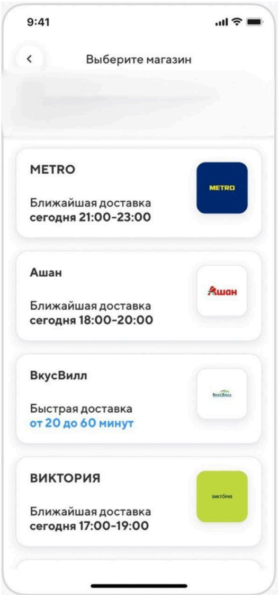

[◀️ Вернуться на главную](README.md)

# Задание 2: Проектирование API

#### Описание:

Интернет-магазин "Петрушка Зеленая" преуспевает, расширяется и в мобильном
приложении решили создать новый экран, который будет отображать магазины
партнеров (см. макеты ниже).



#### Что нужно сделать:

1. Написать пример REST API запроса, который будет вызываться при переходе
   пользователя на данный экран.
2. Привести пример ответа этого REST API в соответствии с макетом. Формат -
   JSON. Учесть, что при клике на плашку магазина должен осуществляться
   переход по ссылке на внешний ресурс.

## Решение

### 1. Анализ макета

Экран содержит:

* кнопку "Назад";
* заголовок экрана;
* список карточек магазинов-партнеров.

Кнопка "Назад" и заголовок относятся к интерфейсу мобильного приложения и не
требуют отдельного API.

На макете отображается вертикальный список карточек магазинов. Элемент пагинации
на экране не показан, но список может быть длинным, поэтому в API стоит
предусмотреть постраничную загрузку данных. Это позволит мобильному приложению
реализовать подгрузку следующей страницы при прокрутке списка.

Для отображения карточки магазина приложению нужны следующие данные:

* `id` - `string`.
  Уникальный идентификатор магазина-партнера.

* `name` - `string`.
  Название магазина для отображения на карточке.

* `logoUrl` - `string`.
  Ссылка для загрузки логотипа магазина. Логотип хранится во внешнем файловом
  хранилище, а приложение получает готовый URL для отображения изображения.

* `externalUrl` - `string`.
  Ссылка на внешний ресурс партнера, которая открывается при клике на карточку
  магазина.

* `deliveryType` - `string`.
  Тип доставки. Возможные значения: `time_slot`, `fast_delivery`.

* `deliveryLabel` - `string`.
  Текстовое описание типа доставки, например "Ближайшая доставка" или
  "Быстрая доставка".

* `deliveryValueText` - `string`.
  Текстовое значение доставки для отображения в интерфейсе, например
  "сегодня 21:00–23:00" или "от 20 до 60 минут". Визуальное оформление
  зависит от `deliveryType`.

### 2. Описание и принятые допущения

1. Метод вызывается при переходе пользователя на экран "Выберите магазин" и
   возвращает список активных магазинов-партнеров с постраничной пагинацией,
   доступных для выбранного города.

2. Предполагается, что экран рендерится на стороне мобильного приложения.
   Backend возвращает данные в формате JSON, а мобильное приложение
   самостоятельно формирует карточки магазинов по макету.

3. Список магазинов-партнеров является публичным и не требует обязательной
   авторизации.

4. Город может быть определен мобильным приложением:
    * из профиля авторизованного пользователя;
    * из ранее выбранного города;
    * по геолокации пользователя;
    * через экран ручного выбора города.

5. Если город не определен, мобильное приложение должно сначала запросить выбор
   города у пользователя и только после этого вызвать метод получения
   магазинов-партнеров.

6. В текущем решении список магазинов определяется по параметру `cityId`,
   так как в задании нет конкретики и мной выбран простой вариант.(В реальном
   приложении для более точного расчета доступных магазинов и интервалов
   доставки лучше использовать адрес доставки
   пользователя, район города или зону доставки.)

7. Backend рассчитывает ближайший доступный интервал доставки на момент
   обработки запроса с учетом таймзоны выбранного города.

8. Таймзона хранится на стороне backend и определяется по `cityId`.

9. В текущем варианте API возвращает готовый текст доставки в поле
    `delivery.valueText`, так как по заданию требуется отобразить данные на
    экране, а сортировка и фильтрация по доставке в макете и описании задания
    не указаны.

10. В рамках текущего задания сортировка, фильтрация и поиск по списку магазинов
    не описаны, поэтому магазины отображаются в том порядке, в котором они
    возвращены backend в массиве `stores`.

11. Логотип магазина передается в виде ссылки `logoUrl`. Отдельный API-запрос
    для получения логотипа не требуется.

12. Поле `externalUrl` в рамках данного решения содержит прямую ссылку на сайт
    партнера без дополнительных параметров для аналитики и без 
    перенаправляющих сервисов.

### 3. REST API запрос

**Краткое описание:** Получение списка магазинов с постраничной пагинацией

**Метод:** `GET`

**URL:** `/api/v1/partner-stores?cityId={string}`

**Структура запроса**

* ***Заголовки***

    * `Accept: application/json`

* ***Query-параметры***

    * `cityId`
        * Тип: _string_
        * Обязательный: да
        * Значение по умолчанию: отсутствует
        * Описание: идентификатор выбранного города.

    * `limit`
        * Тип: _integer_
        * Обязательный: нет
        * Значение по умолчанию: `20`
        * Описание: максимальное количество магазинов в ответе.

    * `offset`
        * Тип: _integer_
        * Обязательный: нет
        * Значение по умолчанию: `0`
        * Описание: смещение для постраничной загрузки списка.

**Пример запроса**

```http
GET https://{домен}/api/v1/partner-stores?cityId=moscow&limit=4&offset=0
Accept: application/json
```

***Структура ответа***

<span style="color: green; font-weight: 600">► Успешный ответ</span>

**HTTP status:** `200 OK`

**Поля ответа:**

1. `pagination` - `object`. Информация о постраничной загрузке списка.
    * `limit` - `integer`. Максимальное количество элементов в ответе.
    * `offset` - `integer`. Смещение текущей страницы.
    * `total` - `integer`. Общее количество найденных магазинов-партнеров.
    * `hasMore` - `boolean`. Признак наличия следующей страницы.

2. `stores` - `array`.
   Список магазинов-партнеров.<br>

   Для каждого найденного магазина возвращается:

    * `id` - `string`.
      Уникальный идентификатор магазина-партнера.

    * `name` - `string`.
      Название магазина для отображения на карточке.

    * `logoUrl` - `string`.
      Ссылка для загрузки логотипа магазина.

    * `externalUrl` - `string`.
      Ссылка на внешний ресурс партнера. При клике на карточку магазин
      открывается
      по этой ссылке.
    * `delivery` - `object`.
      Информация о доставке.

        * `type` - `string`.
          Тип доставки. Возможные значения: `time_slot`, `fast_delivery`.

        * `label` - `string`.
          Текстовая подпись доставки.

        * `valueText` - `string`.
          Текстовое значение доставки для отображения в интерфейсе.

***Пример ответа***

```json
{
  "serverTime": "2026-06-28T16:30:00+03:00",
  "timezone": "Europe/Moscow",
  "pagination": {
    "limit": 4,
    "offset": 0,
    "total": 16,
    "hasMore": true
  },
  "stores": [
    {
      "id": "2f4a6f4c-8e9b-4c4e-9f1a-8a9c2f0d3b11",
      "name": "METRO",
      "logoUrl": "https://{домен}/api/v1/files/store-logos/metro.png",
      "externalUrl": "https://metro.example.com",
      "delivery": {
        "type": "time_slot",
        "label": "Ближайшая доставка",
        "valueText": "сегодня 21:00–23:00"
      }
    },
    {
      "id": "7b1d9f2e-6c35-4b7d-9d2f-5f2d4a8c9012",
      "name": "Ашан",
      "logoUrl": "https://{домен}/api/v1/files/store-logos/auchan.png",
      "externalUrl": "https://auchan.example.com",
      "delivery": {
        "type": "time_slot",
        "label": "Ближайшая доставка",
        "valueText": "сегодня 18:00–20:00"
      }
    },
    {
      "id": "a9c4f2b1-0c5e-4a7d-8b7f-2e9d1a6c3f45",
      "name": "ВкусВилл",
      "logoUrl": "https://{домен}/api/v1/files/store-logos/vkusvill.png",
      "externalUrl": "https://vkusvill.example.com",
      "delivery": {
        "type": "fast_delivery",
        "label": "Быстрая доставка",
        "valueText": "от 20 до 60 минут"
      }
    },
    {
      "id": "c6e8b4d2-9f1a-4e3c-8d7b-1a2f3c4d5e6b",
      "name": "ВИКТОРИЯ",
      "logoUrl": "https://{домен}/api/v1/files/store-logos/victoria.png",
      "externalUrl": "https://victoria.example.com",
      "delivery": {
        "type": "time_slot",
        "label": "Ближайшая доставка",
        "valueText": "завтра 12:00–14:00"
      }
    }
  ]
}
```

<span style="color: red; font-weight: 600">► Ответы на ошибки</span>

**Поля ответа:**

1. `code` - `string`.
2. `message` - `string`.

***Возможные ошибки***

**HTTP status:** `400 Bad Request` -
Ошибка возвращается, если запрос составлен некорректно.

Возможные причины:

* не передан обязательный параметр `cityId`;
* передан неизвестный `cityId`;
* параметры `limit` или `offset` переданы в неверном формате;
* значение `limit` меньше 1;
* значение `offset` меньше 0.

**Пример ответа, если не передан `cityId`:**

```json
{
  "code": "VALIDATION_ERROR",
  "message": "Не передан обязательный параметр cityId"
}
```

**Пример ответа, если передан неизвестный город:**

```json
{
  "code": "CITY_NOT_FOUND",
  "message": "Город с указанным идентификатором не найден"
}
```

**Пример ответа, если неверно передан limit:**

```json
{
  "code": "VALIDATION_ERROR",
  "message": "Параметр limit должен быть положительным целым числом"
}
```

**HTTP status:** `500 Internal Server Error` -
Ошибка возвращается при внутренней ошибке сервера.

**Пример ответа:**

```json
{
  "code": "INTERNAL_SERVER_ERROR",
  "message": "Внутренняя ошибка сервера"
}
```

### 4. Возможное расширение API

В текущем примере API спроектирован под отображение данных на экране и не
включает сортировку или фильтрацию по доставке.

Если в дальнейшем потребуется сортировать магазины по ближайшему времени
доставки, фильтровать по типу доставки или проверять актуальность интервала на
стороне мобильного приложения, в объект `delivery` можно добавить
машиночитаемые поля:

* `startsAt` - дата и время начала ближайшего интервала доставки в формате
  ISO 8601,<br> например "2026-06-28T21:00:00+03:00";

* `endsAt` - дата и время окончания ближайшего интервала доставки в формате
  ISO 8601,<br> например "2026-06-28T23:00:00+03:00";

* `durationFromMinutes` - минимальное время быстрой доставки в минутах, <br>
  например `20`;

* `durationToMinutes` - максимальное время быстрой доставки в минутах, <br>
  например `60`.

Также в реальном приложении для более точного расчета доступных магазинов и
интервалов доставки можно использовать не только `cityId`, но и точный адрес
доставки, район города, зону доставки или геолокацию пользователя.
