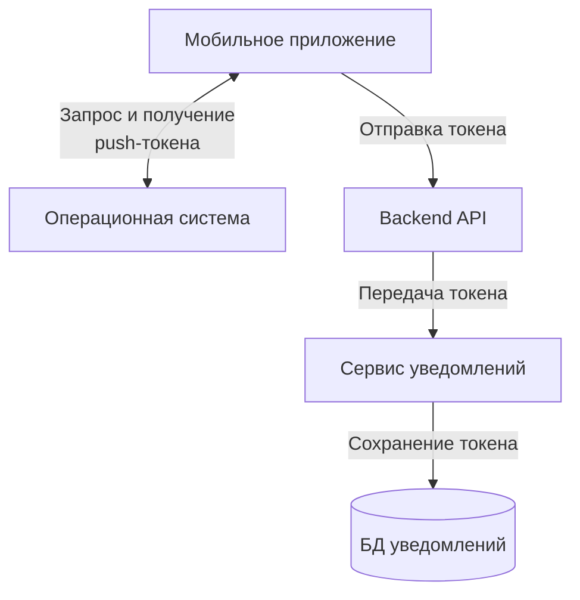
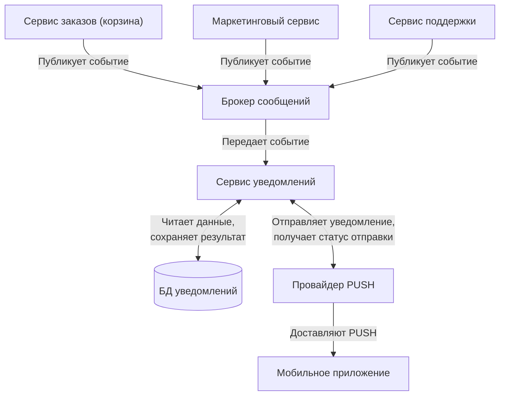

[◀️ Вернуться на главную](README.md)

# Задание 3: Архитектура

### Описание:

Заказчик хочет, что в мобильное приложение интернет-магазина "Петрушка Зеленая" начали приходить
пуши. Они могут быть разными: о том, что заказ слишком долго лежит без действий в корзине, об отмене
заказа, рекламные рассылки и прочее. То есть нужен функционал, а какие пуши отправлять - точно
найдется.

### Что нужно сделать:

Построить верхнеуровневую архитектурую схему - как должна работать отправка PUSH уведомлений в
данном приложении. Можно просто в виде блок схем. Считаем, что на бэкенде микросервисная
архитектура. В данном задании рекомендуется в интернете изучить архитектуры подобных решений.
Быть готовым на собеседовании обсудить эту схему.

## Решение

### 1. Описание и принятые допущения

Для корректной отправки push backend должен знать, на какое устройство пользователя нужно
отправить уведомление. Для этого мобильное приложение сначала получает push-токен устройства и
передает его на backend. В связи с этим решение разделено на две схемы:

1. Регистрация push-токена устройства;
2. Отправка PUSH-уведомления по событию из микросервисов.

В рамках данного решения предполагается, что backend построен по микросервисной архитектуре.
Отдельные бизнес-сервисы публикуют события, которые могут стать основанием для отправки уведомления.
Для упрощения предполагается, что отложенные и периодические события могут публиковаться самими
бизнес-сервисами, так как внутри них есть собственный механизм планирования задач. Например, 
сервис корзины может периодически проверять неактивные корзины и публиковать отложенные или 
периодические события для отправки напоминания.

Бизнес-сервисы не отправляют PUSH-уведомления напрямую. За подготовку и отправку уведомлений так же
отвечает отдельный микросервис уведомлений.

Брокер сообщений используется для асинхронной передачи событий от бизнес-сервисов в сервис
уведомлений. Это позволяет не связывать бизнес-сервисы напрямую с логикой отправки PUSH-уведомлений,
повышает надежность обработки событий при сбоях или высокой нагрузке.

В базе данных уведомлений могут храниться:

* push-токены устройств
* шаблоны уведомлений
* настройки пользователя
* история и статусы отправок

Провайдер PUSH-уведомлений отвечает за доставку уведомления на устройство пользователя. В реальном
приложении для Android может использоваться FCM, для iOS — APNs и тд.

### 2. Схемы

#### 2.1. Регистрация push-токена устройства

***Описание схемы*** 

Перед отправкой PUSH-уведомлений мобильное приложение должно получить push-токен устройства. 
Push-токен нужен для того, чтобы backend мог определить, на какое устройство пользователя 
отправлять уведомление. Если пользователь авторизован на нескольких устройствах, у него может 
быть несколько push-токенов. В этом случае сервис уведомлений может хранить несколько токенов 
для одного пользователя.

Мобильное приложение получает push-токен через операционную систему и механизм push-уведомлений. 
После этого приложение отправляет токен на backend (например Rest API методом: POST 
/push-tokens). Backend передает полученный токен в сервис уведомлений. Сервис уведомлений 
сохраняет или обновляет токен в базе данных уведомлений.

#### 2.2. Отправка PUSH-уведомления

***Описание схемы***

Cервисы публикуют события в брокер сообщений. Событие содержит данные, которые нужны для 
подготовки уведомления:

* тип события
* идентификатор пользователя
* дополнительные параметры для текста уведомления и тд.

Сервис уведомлений получает событие из брокера сообщений и выполняет основную логику отправки:

* определяет тип уведомления;
* получает шаблон уведомления;
* проверяет настройки пользователя;
* получает push-токен устройства;
* формирует текст уведомления;
* отправляет уведомление через push-провайдера;
* сохраняет результат отправки в базе данных уведомлений.

Провайдер PUSH-уведомлений доставляет уведомление в мобильное приложение. Сервис уведомлений 
может получить от провайдера статус отправки, например успешная отправка, ошибка или невалидный 
push-токен.

Если push-токен стал невалидным, сервис уведомлений может пометить его как неактивный, чтобы не 
использовать его для следующих отправок.